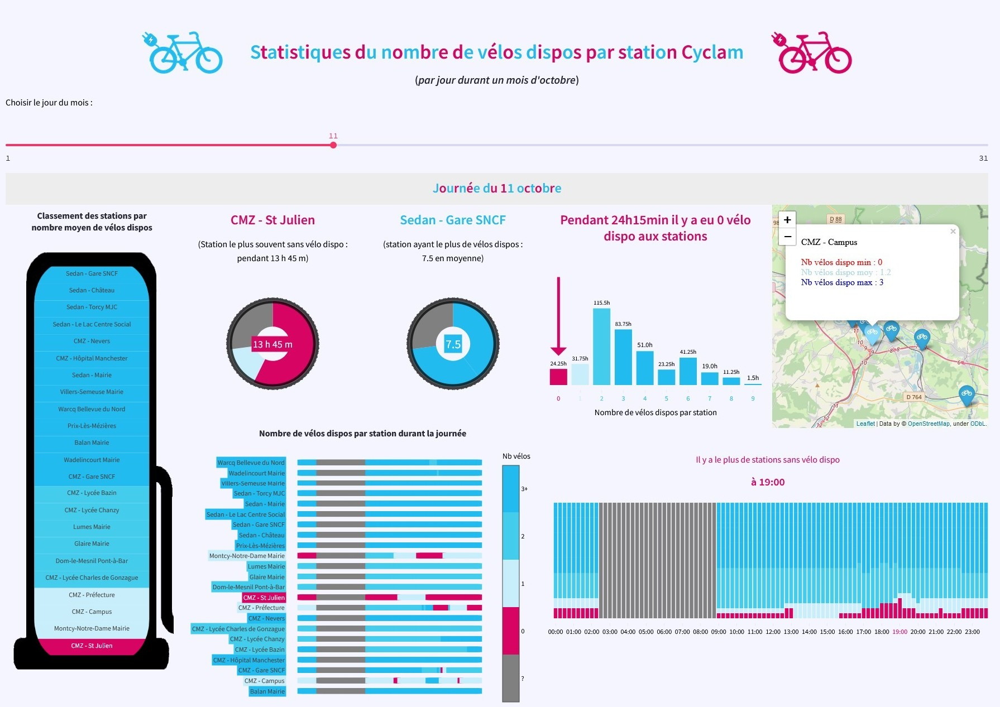

Tableau de bord interactif des stations ${\color{#21bbef}C}$ ${\color{#d70464}y}$ ${\color{#21bbef}c}$ ${\color{#d70464}l}$ ${\color{#21bbef}a}$ ${\color{#d70464}m}$  

> [!IMPORTANT]
> Ceci est une réalisation personnelle et n'a rien d'officiel.  
> Les données ne sont que purement indicatives.  
> Elles ont été relevées via API toutes les 15 minutes pendant le mois d'octobre.  
> (avec quelques interruptions dues à mon ordinateur)  
> Entre deux relevés des vélos ont pu être loués sans que cela apparaisse.

> [!NOTE]
>  - Réalisation entièrement en python (avec un soupçon de HTML/CSS) :
>    >  - recueil des données via API : requests
>    >  - traitement des données : pandas
>    >  - création des graphiques : plotly, folium
>    >  - création d'une app et mise en ligne : Streamlit
>  - images (avec quelques modifications conformément à la license) : [https://pixabay.com](https://pixabay.com)
 
Lien vers le tableau de bord : [Tableau de bord des stations Cyclam](https://cyclam-stations.streamlit.app/)  

 <a href="https://cyclam-stations.streamlit.app/" target="_blank">

[site officiel Cyclam](https://cyclam.ecovelo.mobi/#/home)
(location de vélos électriques d'Ardenne Métropole)

